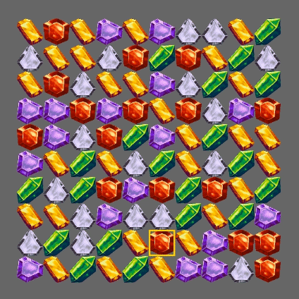

# Bevy Match 3

[](https://crates.io/crates/bevy_match3)
[](https://docs.rs/bevy_match3)
[](https://crates.io/crates/bevy_match3)




`bevy_match3` is a crate for handling the logic side of match 3 games in [Bevy](https://bevyengine.org/).

## Bevy Version Support
| `bevy` | `bevy_match3` |
| ------ | ------------- |
| 0.6    | 0.0.1           |
| 0.7    | 0.0.2           |

## Features
- Configurable number of gem types and board dimensions
- Guaranteed no matches at board creation
- Cascading matches

## Immediate todo
- [ ] Event for no matches
- [ ] Board shuffling
- [ ] Decouple board from plugin and make multiple boards example

## Possible todo based on demand
- [ ] Entities instead of u32 gem types
- [ ] More Match types
- [ ] Customizing various aspects like letting swaps succeed always and allowing matches at board creation

## Examples
To get started with this crate all you need is to set up the plugin
```rust
use bevy_match3::prelude::*;
fn main() {
    App::new()
        .add_plugins(DefaultPlugins)
        .add_plugin(Match3Plugin)
        .run();
}
```
React to board events 
```rust
fn consume_events(
    mut events: ResMut<BoardEvents>,
) {
    if let Ok(event) = events.pop() {
        match event {
            BoardEvent::Swapped(pos1, pos2) => todo!(),
            BoardEvent::FailedSwap(pos1, pos2) => todo!(),
            BoardEvent::Popped(pos) => todo!(),
            BoardEvent::Matched(matches) => todo!(),
            BoardEvent::Dropped(drops) => todo!(),
            BoardEvent::Spawned(spawns) => todo!(),
        }
    }
}
```
and start sending commands to the board using the `BoardCommands` resource!


For now there is one example of all features at [`basic.rs`](examples/basic.rs)

## License
Note that this project is licensed under the [`Anti-Capitalist Software License`](https://anticapitalist.software/). If this proves a major obstacle for adoption I may consider a more conventional license, I would just like to avoid this crate being flipped by the likes of King and similar.

## Credits
- **Ilustragm** for their awesome gem icon pack used in the examples! https://ilustragm.itch.io/set-gems-icon-01